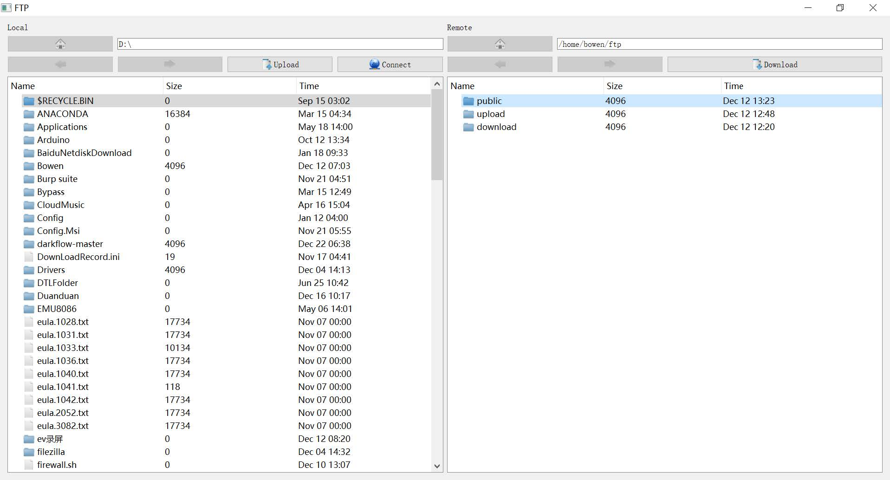

# FTP
FTP Client and Server in Python, project for IS301 in SJTU. 

## Code structure
```
|-- GUI
|------ ClientGui.py       Client GUI in pyqt5
|------ LoginGui.py        Login GUI
|-- icons                  Client GUI icons
|-- dialog.py              Dialogs like login, download and upload
|-- utils.py               Get info of files
|-- client.py              FTP Client
|-- server.py              FTP Server
```

## Feature
1. User can access ftp server.
2. Client GUI can show local and remote file list.
3. User can download and upload file.
4. User can new, delete, rename a file on local computer as well as remote server.
5. User can edit remote file.

## Client


## How to use
On local pc, just run *client.py*.<br>
On server, run *server.py*.
